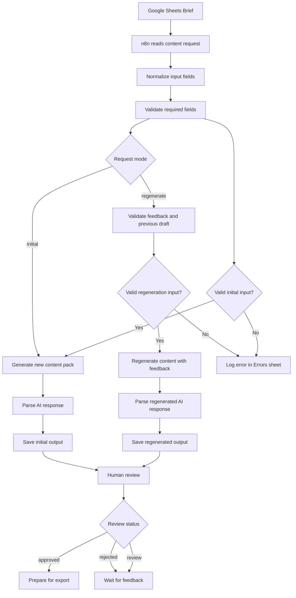

# Real Estate Content Pack Generator

A CRM-agnostic AI automation MVP built with n8n, Google Sheets and the OpenAI API.

This project generates structured real estate content packs from a simple brief, supports human review, allows regeneration with feedback, logs validation errors and prepares approved content for future publishing or external platform integration.

## Problem

Real estate and service-based businesses often need regular social media content, but their content process can be manual, inconsistent and difficult to scale.

Common issues include:

- Content ideas are scattered across different places.
- Captions, hooks and scripts are created manually.
- There is no clear review or approval flow.
- Feedback is not always captured in a structured way.
- Approved content is not always prepared for future publishing or export.
- Content production lacks a repeatable structure.

## Solution

This MVP creates a structured content generation workflow.

The user submits a content brief in Google Sheets. n8n reads the brief, validates the required fields, calls the OpenAI API, generates a content pack and saves the output into structured sheets for review, regeneration, error tracking and export.

The system is designed to be reusable for real estate businesses, mortgage brokers, buyer agents or other service-based businesses that need repeatable content creation workflows.

## Current MVP Scope

The current version focuses on text-based content generation, workflow structure and portfolio-ready documentation.

It includes:

- Google Sheets as the input, review and output layer
- n8n as the automation engine
- AI-generated content packs
- Two request modes: `initial` and `regenerate`
- Human review status management
- Error logging without stopping the full execution
- Export structure for future manual publishing or platform integration
- Idea Bank and Preset Library for reusable content angles
- Video-ready output fields for Reel production
- Structured testing matrix with 10 test cases
- Basic API retry logic for temporary API failures
- Screenshot documentation for portfolio review

## Tech Stack

| Tool | Purpose |
|---|---|
| n8n | Workflow automation |
| Google Sheets | Input, output, review, testing and export structure |
| OpenAI API | AI content generation |
| GitHub | Portfolio documentation and project repository |

## Main Workflow Logic

## Project Screenshots

The repository includes visual documentation of the MVP in the `screenshots/` folder.

Screenshots include:

- n8n workflow overview
- Google Sheets structure
- generated output example
- review flow example
- testing matrix
- error handling example

See: [`screenshots/`](./screenshots)

## Documentation

Additional project documentation is available in the `docs/` folder:

- [`project-overview.md`](./docs/project-overview.md) — business problem, solution, scope and roadmap
- [`workflow-notes.md`](./docs/workflow-notes.md) — workflow logic, validation, parsing, API reliability and limitations
- [`development-log.md`](./docs/development-log.md) — summary of the main development milestones

## Input Fields

The workflow uses a Google Sheets brief with fields such as:

- `request_mode`
- `content_type`
- `platform`
- `goal`
- `idea_seed`
- `key_facts`
- `target_client`
- `property_type`
- `suburb`
- `brand_voice`
- `offer_angle`
- `compliance_note`
- `feedback`
- `generated_caption`

## Generated Output Fields

The main generated content pack includes:

- `hooks`
- `script`
- `visual_structure`
- `on_screen_text`
- `camera_angle`
- `b_roll_idea`
- `text_overlay_priority`
- `editing_note`
- `generated_caption`
- `cta`
- `hashtags`

## Video-Ready Fields

The workflow includes production-focused fields to make each content pack more useful for Instagram Reel creation.

These fields help guide:

- camera framing
- B-roll footage
- text overlay hierarchy
- editing direction

This makes the output more practical for short-form video production, not only caption generation.

## Review Flow

The MVP includes a human review layer with clear content statuses:

- `draft`
- `review`
- `approved`
- `rejected`
- `exported`

For regenerated content, the status is set to `review` because the output still needs human approval before it can be exported or published.

## Error Handling

The workflow validates required fields before generating content.

For the initial generation branch, the minimum validation includes:

- `goal`
- `idea_seed`
- `key_facts`

For the regeneration branch, the workflow also validates:

- `feedback`
- `generated_caption`

Invalid rows are logged in the `Errors` sheet instead of stopping the full workflow execution. This allows valid rows to continue processing even when another row contains missing or incomplete information.

## Testing

The workflow was tested with 10 structured test cases covering both valid and invalid scenarios.

The test matrix included:

- Valid initial content generation
- Missing required fields in the initial branch
- Valid regeneration with feedback
- Missing feedback in the regeneration branch
- Missing previous draft in the regeneration branch
- Validation of the new video-ready fields
- Verification that content fields remain separated correctly

The main fields tested were:

- `goal`
- `idea_seed`
- `key_facts`
- `feedback`
- `generated_caption`

Each test was documented with expected behaviour, actual result, status and issue found.

## API Reliability

Basic API resilience was added to both OpenAI HTTP Request nodes.

The workflow uses retry logic to reduce the impact of temporary API failures or rate-limit issues.

Current configuration:

- Retry on Fail: enabled
- Max tries: 3
- Wait between tries: 3000 ms

If the API still fails after the retry attempts, the execution stops. A future improvement would be to log these failed API attempts directly into the `Errors` sheet instead of stopping the execution.

## Google Sheets Structure

The project uses a spreadsheet structure with tabs such as:

- `content_requests`
- `generated_outputs`
- `Review`
- `Errors`
- `Export`
- `Idea_Bank`
- `Preset_Library`
- `Tests`

## Preset Library

The MVP includes five reusable real estate content presets:

1. Listing reel
2. Suburb guide
3. Market update
4. First-home buyer tip
5. Seller objection

Each preset includes a definition and example seed ideas to help generate more consistent content.

## Export Structure

The export layer is designed to be platform-agnostic.

It includes operational fields such as:

- `platform`
- `caption`
- `hashtags`
- `approval`
- `category`
- `post_time`
- `notes`

It also includes strategic fields such as:

- `preferred_post_time`
- `KPI_goal`
- `funnel_stage`
- `performance_hypothesis`

This prepares the content for future manual publishing, CSV export or integration with external platforms.

## Business Value

This project shows how AI and automation can support a more structured content operation.

Instead of only generating random captions, the system creates a repeatable workflow with:

- Better input structure
- AI-assisted content generation
- Review and feedback loop
- Error tracking
- Export-ready content
- Reusable content presets
- Video-ready production guidance
- Structured testing

This makes the process more scalable and easier to adapt for future clients.

## Current Limitations

This MVP does not currently include:

- Direct CRM integration
- Direct publishing to social media platforms
- Automatic trend scraping
- Automatic performance analytics
- Automatic video editing or visual asset generation
- Advanced compliance review
- API failures after retry attempts are not yet automatically logged into the Errors sheet
- The n8n workflow JSON is not included yet as a public export

The focus of this version is to prove the workflow logic and create a reusable foundation.

## Future Improvements

Possible phase 2 improvements:

- Add direct integration with a CRM or publishing platform
- Add CSV export for bulk scheduling
- Add automatic image generation for social media assets
- Add Instagram Story and carousel generation
- Add automatic video editing or template-based rendering
- Add AI-assisted competitor analysis
- Add performance tracking and learning from previous posts
- Add automatic content calendar generation
- Add stronger error diagnostics
- Add safe n8n workflow JSON export
- Add bulk processing with Loop Over Items + Wait
- Add separate AI agents for reels, carousels, stories and market updates

## Project Status

MVP completed for portfolio presentation.

Current stage:

- Core workflow completed
- Initial generation branch completed
- Regeneration branch completed
- Review and status flow completed
- Error logging completed
- Video-ready output fields added
- Export structure created
- Retry logic added to both OpenAI API request nodes
- 10 structured test cases completed
- Project screenshots added
- Screenshot documentation completed
- Project overview documentation completed
- Workflow notes documentation completed
- Development log completed
- GitHub repository prepared as a portfolio asset

## Security and Privacy Note

This repository does not include API keys, credentials, OAuth secrets, private webhook URLs or real client data.

Screenshots and documentation are used to demonstrate the workflow structure and project logic without exposing sensitive information.

## Author

Created by Rodrigo Malaver.

This project is part of my automation and AI portfolio, focused on building practical workflows using n8n, APIs, Google Sheets and AI tools.

- LinkedIn: [Rodrigo Malaver](https://www.linkedin.com/in/helbert-rodrigo-malaver-casallas/)
- Email: rodri.malaverc@gmail.com
